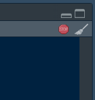

```{r setup,include=FALSE}
```


# Preliminares

Antes de iniciar o curso é importante que vocês alunos sigam algumas etapas. A primeira delas é responder o forms disponibilizado no Classroom para eu conhecer um pouco de vocês e modular o conteúdo/roteiro dos nossos encontros. Nele pergunto sobre os conhecimentos prévios em programação e seus objetos de pesquisa. O ideal seria algum dos objetos servir de fonte de dados para trabalharmos em aula. As respostas são anônimas.

A segunda etapa é seguir o tutorial abaixo de instalação do R e do RStudio. São dois programas diferentes, mas bem simples de serem instalados. Elaborei um tutorial próprio no Windows, mas também é possível instalar no Mac e no Linux. Os tutoriais para estes dois últimos são de terceiros.

-   [Tutorial Windows](https://drive.google.com/file/d/1DoHh0yICeu2-NnSndg22dYqCCdi7FP42/viewhttps://drive.google.com/file/d/1DoHh0yICeu2-NnSndg22dYqCCdi7FP42/view)

-   [Tutorial Mac](https://www.youtube.com/watch?v=rr54DqsJJjY)

-   [Tutorial Linux](https://www.youtube.com/watch?v=L01y0W7rnnA)

Disponibilizo também dois livros sobre a linguagem e a interface RStudio. O de Aquino é um pouco datado mas ainda funciona e está em português. O de Wickham é super recente (atualizado em junho de 2023), possui exercícios e é gratuito, mas está em inglês. Usem ambos para consultas e/ou aprofundar os estudos.

-   ["R para cientistas sociais" por Jakson Aquino](https://drive.google.com/file/d/14dclrDG0kV6ZuW0fJQxSgjXnHGsuVcWi/view)

-   ["R for Data Science" por Hadley Wickham e colegas](https://r4ds.hadley.nz/)

Por fim, disponibilizo aqui um glossário de termos usados no roteiro, scripts e durante as aulas. Ele é passível de expansão tanto por mim quanto por vocês (caso haja demanda).

-   [Acesse o glosário aqui!](https://docs.google.com/document/d/1Tewif9K5ZXFJfRe-3InCMk-HN401ilslLPvyvn6xpsE/edit?usp=sharing)

Esta página e o material aqui usado estarão sempre disponível aos alunos e podem ser consultados novamente e compartilhados.

Aproveitem!

# Primeiro encontro (06/09)

::: {style="display: flex;"}
<div>

Neste curso, iremos nos familiarizar com a linguagem R e a interface RStudio. Não iremos exaurir todas as possibilidades, mas apenas introduzir de maneira geral noções básicas de programação para fins acadêmicos. Num segundo momento, cursos mais específicos serão ofertados focados em análise textual e análise estatística, os quais serão melhor aproveitados após o primeiro contato com a linguagem.

A linguagem R foi criada no próprio meio acadêmico por estatísticos. Logo, ela já nasce no nicho de nosso interesse. RStudio é uma interface que roda a linguagem R original, mas nos oferece vários artifícios gráficos mais intuitivos do que a linguagem original. Hoje, o RStudio passa por um rebranding e se tornou Posit, uma interface multi-tarefas de programação mais ampla.

</div>

<div>


</div>
:::

## A interface e suas abas

A interface possui quatro painéis. No (1) temos o editor de texto, onde os arquivos com nossos scripts aparecem. No (2) temos o console, um espaço destinado a executação dos comandos. No (3) temos o "enviroment", espaço onde ficam expostos todos os objetos criados na sessão atual. No (4) temos um painel multifuncional, onde ficam visualizações criadas, arquivos localizados na área de trabalho selecionada (mais disso em outro momento ou consultando o glossário), entre outras funções (carinhosamente apelidado de "painel de resto").

A diferença entre o editor de texto (1) e o console (2) é bem simples: o primeiro permite salvar códigos num arquivo dentro da máquina do usuário, passível de ser executado múltiplas vezes e compartilhado (no formato ".R"); o segundo apenas recebe comandos, não sendo possível salvá-lo para re-execução.

Além dessas quatro telas, temos também a barra de ferramentas no alto da página (5). Nela, temos opções tradicionais de todos os programas de computadores. Para nosso caso, as abas "Tools" e "Help são as mais importantes. Na primeira temos a subopção"Global Options", que serve para configurar o software. Na segunda temos acesso as "cheatsheets", (as "colinhas"), e ao "Keyboard Shortcut Help", uma lista de atalhos no teclado.


## Primeiras linhas de código

Iremos escrever nossas primeiras linhas de código no editor de texto, para mantê-las salvas. A função mais primária do R é a de uma calculadora. Abaixo temos alguns cálculos matemáticos.

###  {.tabset .unlisted .unnumbered}

#### Operações simples

```{r}
1+1
4-2
2*5
100/10
```

#### Potência

```{r}
10^2 
2^2
```

#### Múltiplas operações

```{r}
(2+2)*100
```

#### Porcentagem

```{r}
((2+5+7+9+3+11+2)/39)*100
((2+5+7+9+3)/39)*100
```

#### Média

```{r}
(2+5+7+9+3+11+2)/7
```

##  {.unlisted .unnumbered}

Notem como os comandos são escritas e aninhados. Usamos parênteses para separar processos. No caso da média, por exemplo, a parte da soma do cálculo é toda contida dentro de um parênteses, para em seguida esse resultado ser dividido por 7 (o número de elementos somados). É um processo muito semelhante ao ordenamento de operações na matemática convencional.

Também podemos fazer comparações usando de operadores lógicos, sinais matemáticos que avaliam se uma determinada condição é verdadeira ou falsa. Abaixo temos uma lista retirada de [Aquino (2014)](https://drive.google.com/file/d/14dclrDG0kV6ZuW0fJQxSgjXnHGsuVcWi/view) de alguns operadores convencionais da área e alguns exemplos. Podemos amontoar múltiplas comparações usando operadores entre duas ou mais comparações.


###  {.tabset .unlisted .unnumbered}

#### Comparações simples

```{r}
2 == 3
3 == 3
(9/3) == 3
4 != 5
7 != 7
5 < 9
11 > 9
```

#### Comparações complexas

```{r}
2 == 3 & 3 == 3
3 == 3 & 9/3 == 3
```

#### Comparações de condicionais

```{r}
#T & F = F 
T == T & T == F 
#F & F = F
T == F & T == F 
#T | F = T
T != F | T != T 
#F | F = F
T == F | F != F 

```

##  {.unlisted .unnumbered}

Percebam como acima eu faço uso de hashtags (\#) nos códigos. O R não interpreta nada que vem depois de uma hashtag, logo é comum, além de uma boa prática, usar desse símbolo para comentar o código, como fizemos acima.

## Funções

Apesar de ser possível de executar cálculos e outros procedimentos dessa forma, a magia do R vem das funções, comandos que executam processos pré-definidos usando de argumentos. Elas funcionam de forma muito semelhante a funções do Excel ou até funções matemáticas, sendo necessário chamarmos seus nomes, abrirmos parênteses, oferecermos os argumentos obrigatórios e/ou opcionais e finalmente fecharmos os parênteses.

Abaixo temos a função *seq*, que cria sequências numéricas. Ela tem como argumentos obritatórios: "from", que define um ponto de partido da sequência; e "to", que define o ponto de chegada da sequência. Há outros argumentos opcionais que podem limitar a unidade de contagem ("by") e o tamanho da sequência ("length.out").

```{r}
seq(from = 100, to = 125)
```

Podemos escrever manualmente o nome do argumento seguido de "=" e o valor que queremos dar pra ele ou ainda só escrever o valor no lugar que a função espera que esteja este argumento. Por exemplo, em *seq* o primeiro argumento sempre é o "from" e o segundo sempre é o "to". Se rodarmos o código abaixo veremos que o resultado é o mesmo de antes. Memorizar a posição dos argumentos nem sempre é uma boa ideia. É preferível saber quais os nomes dos argumentos.

```{r}
seq(100,125)
```

O R permite o encadeamento de funções e processos, ou seja, o resultado de uma função pode ser passado à uma outra *ad infinitum*. Só precisamos no atentar com o fecharmos e abrir dos parênteses. Abaixo pegamos nossa sequência criada acima, somamos os números com 10 e só depois dividimos por 100.

```{r}
(seq(100,125)+10)/100
```

Caso não tívemos usado os parênteses, o resultado seria diferente, como ocorre abaixo.

```{r}
seq(100,125)+10/100
```

Para consultar os argumentos de uma função, digite "?" seguido do nome da função. Uma janela irá abrir no painel multifunção (canto inferior direito), com infos da função, os argumentos e até alguns exemplos de código.

```{r,eval=FALSE}
?seq
```


## Objetos unidimensionais

Objetos em R são itens referenciáveis que contém informações. Referenciável porque ele pode ser "chamado" e usado com outros objetos, processos ou funções. Informações podem ter diversos tamanhos e formatos.

Chamamos eles de unidimensionais porque eles armazenam as informações em formato "de linha", sempre contendo apenas um tipo de dado. Essa caracterização ficará mais evidente quando tratarmos dos objetos multidimensionais.

A criação de objetos em R é bem simples. Damos um nome ao objeto (que não pode conter espaços e nem começar com números), utilizamos o operador de associação *\<-* (sinal de "menor que" seguido de um hífen) e oferecemos o conteúdo do objeto. No caso abaixo nós criamos um objeto com quatro elementos (neste caso, letras), o que implica a necessidade de usar a função *c()*, de concatenar. Para consultarmos o objeto, basta digitarmos seu nome e rodarmos o código.

###  {.tabset .unlisted .unnumbered}

#### Objetos com letras

```{r}
objeto <- c("a","b","c","d")
objeto
```

#### Objetos com números

```{r}
objeto_numero <- c(3,4,1,2)
objeto_numero
```

##  {.unlisted .unnumbered}

Percebam como para o objeto com letras (texto), cada elemento precisa estar fechado em aspas, enquanto que para o objeto com números isso não ocorre. O R não interpreta elementos de texto sem aspas, por isso o objeto abaixo que combina letras e números nos oferece um erro. Na aba seguinte temos a versão correta desse objeto.

###  {.tabset .unlisted .unnumbered}

#### Letras e números (errado)

```{r, error=TRUE}
objeto_misto <- c(a,5,b,9,c,1)
```

#### Letras e números (correto)

```{r}
objeto_misto <- c("a",5,"b",9,"c",1)
objeto_misto
```

##  {.unlisted .unnumbered}

Também podemos ainda apenas solicitar um *print* dos dois objetos separados criados antes. Essa função apenas mostra o conteúdo solicitado no console. Percebam como o R, na impressão, coloca aspas em todos os elementos. Isso ocorre porque é impossível criar um objeto unidimensional (mais sobre isso adiante) com múltiplos tipos de dados (números, letras, booleanos, etc.).

```{r}
print(c(objeto,objeto_numero))
```

Podemos criar sequências de números usando algumas estratégias. Primeiro, usando o carácter de dois pontos(":"), oferecemos um número de partida a esquerda, de chegada a direita e amarramos tudo dentro da função *c*. Outra forma seria usando a função *seq*, já mencionada antes aqui: oferecemos um número de partida (from) e um de chegada (to). Aqui oferecemos também a unidade do incremento da sequência (by).

```{r}
sequencia <- c(1:10)
sequencia

sequencia_par <- seq(from = 0, to = 10, by = 2)
sequencia_par
```

Esses objetos numéricos podem ser usados em cálculos matemáticos. Basta digitarmos o nome do objeto e a operação que desejamos aplicar. O resultado é a aplicação do cálculo para cada elemento do objeto.

```{r}
objeto_numero+2
sequencia_par+5
```

## Tipos de dados

A linguagem R suporta uma variedade de tipos de dados. O que os diferencia é o tipo de processos/funções que são aplicáveis a cada um deles. Não é por acaso os tipos são muito semelhantes àqueles usados nas clássicas definições metodológicas (quanti/quali,categórico,nominal,ordinal, etc). Para consultarmos a classe de um objeto usamos a função *class*.

###  {.tabset .unlisted .unnumbered}

#### Character (texto)

Qualquer tipo de texto, inclusive números declarados como texto.

```{r}
objeto_character <- c("ave","cachorro","gato")
objeto_character

class(objeto_character)
```

#### Factor (categoria)

Texto transformado em categoria. Diferente do character, os factors impedem a entrada de dados que não apresentem valores listados no conjunto de valores permitidos. Para consultar os valores permitidos, usamos a função *levels*.

```{r}
objeto_factor <- factor(c("muito","normal","pouco"))
objeto_factor

class(objeto_factor)

levels(objeto_factor)
```

#### Numeric (número)

Valores numéricos usados em cálculos matemáticos.

```{r}
objeto_numeric <- c(1.3,2,4.9,7.2,9.5)

class(objeto_numeric)

objeto_numeric+2
```

#### Logical (booleano/binário)

Verdadeiros (T, TRUE) e falsos (F, FALSE).

```{r}
objeto_logical <- c(T,F,T,T,F,F)
objeto_logical

class(objeto_logical)
```

##  {.unlisted .unnumbered}

É possível converter os dados entre os diferentes tipos, porém é preciso cautela porque nem toda conversão é automaticamente compatível e acaba gerando perda de informações.

As funções que fazem conversões são as que começam com o prefixo *as.*. Abaixo temos alguns exemplos das conversões e dos resultados após.

###  {.tabset .unlisted .unnumbered}

#### Character para factor (e vice-versa)

```{r}
as.factor(objeto_character)
class(as.factor(objeto_character))

as.character(objeto_factor)
class(as.character(objeto_factor))
```

#### Numeric para character

```{r}
as.character(objeto_numeric)
class(as.character(objeto_numeric))
```

#### Factor para numeric

```{r}
as.numeric(objeto_factor)
class(as.numeric(objeto_factor))
```

#### Logical para character ou numeric

```{r}
as.character(objeto_logical)
class(as.character(objeto_logical))

as.numeric(objeto_logical)
class(as.numeric(objeto_logical))
```

##  {.unlisted .unnumbered}

## Índices

Todo elemento de um objeto possui um índice, um lugar específico dentro daquele objeto. Caso chamemos o objeto junto com um índice, recuperaremos apenas o(s) elemento(s) respectivo(s) daquele índice. A melhor analogia é a de uma cadeira enumerada dentro de uma sala: apenas uma pessoa senta numa cadeira, logo há apenas um nome num determinado lugar.

Para referenciar um índice usamos o nome do objeto, seguido de colchetes e o número do índice desejado. Podemos também selecionar múltiplos índices usando os dois pontos (":"). Abaixo temos alguns exemplos com os nossos objetos criados até então.

```{r}
objeto_character[3]

objeto_factor[1]

objeto_numeric[1:4]

objeto_logical[4:6]
```

##  {.unlisted .unnumbered}

## Objetos multidimensionais

Objetos multidimensionais são aqueles que armazenam mais de um objeto unidimensional (como aqueles criados e estudados nas seções acima). Temos vários tipos deles, mas os que estão presentes no R base são: as matrizes, as listas e os data frames.

### Matrizes (matrix)

Matrizes em R são como as suas homônimas em matemática: um conjunto de números armazenados em linhas e colunas. Elas se assemelham em muito com tabelas em Excel e afins. Nem sempre usamos elas, já que os data.frames são muito semelhantes e mais versáteis para manipular, mas é comum nos depararmos com elas em análises estatísticas (como matrizes de correlação). Estes objetos armazenam apenas objetos do mesmo tipo (todos números, todos texto, etc).

```{r}
matrix(data=c(1,2,3,4,5,6,7,8,9),nrow=3,ncol=3)
```

### Listas (list)

Listas são objetos que armazenam outros objetos de tamanhos e tipos distintos. Uma lista pode conter uma matriz de 500 por 500, junto com um objeto character de um só elemento, um objeto numeric com múltiplos valores e um data.frame com centenas de linhas e colunas.

```{r}
list(x=list("a",c(1,2,3),"c"),
     y=list(T,F,c("a","b")),
     z=list("teste1","teste2",c(T,F,T)))
```

A melhor analogia é de um gabinete de escritório: um gabinete tem múltiplas gavetas, todas com números diferentes de pastas; estas armazenam diferentes documentos, de diferentes tamanhos e funcionalidades.


Listas têm seus usos em casos específicos. Um deles são em regressões: o resultado de um cálculo de uma regressão em R (usando a função *lm*, por exemplo) são múltiplos valores. Temos R², resíduos, matrizes de correlação, coeficientes, equação inicial (y=a+bx+u), todos de tipos e tamanhos diferentes.

### Data frame

Data frames são versões melhoradas de matrizes, já que também trabalham com linhas e colunas, mas eles permitem o armazenamento de múltiplos tipos de dados em cada uma das colunas. Por exemplo, temos o objeto abaixo que possui dados de alunos e comidas (textos ou factors), presença (booleano/lógico) e idade (numérico). Nele, manualmente preenchemos as colunas usando a função *c* e separamos cada coluna usando uma vírgula (",").

```{r}
data.frame(alunos=c("matheus","carlos","bossa","gustavo"),
           comida_preferida=c("macarronada","salgadinho","bolacha","churrasco"),
           presenca=c(T,T,F,T),
           idade=c(14,18,20,47))
```

Para facilitar a leitura, após cada coluna eu pressiono a tecla "Enter" para descer uma linha. O R não lê esse Enter e nem espaços ou tabs (na maioria dos contextos), logo usamos disso para tornar nosso código mais organizado. Mesmo assim, posso escrever tudo numa só linha sem problema alguma.

```{r}
data.frame(alunos=c("matheus","carlos","bossa","gustavo"),comida_preferida=c("macarronada","salgadinho","bolacha","churrasco"),idade=c(14,18,20,47))
```

Grande parte da atuação com R para análise de dados e mesmo desenvolvimento de estudos em outros objetos de pesquisa usa muito dos data.frames e suas particularidades. Por isso dedicaremos mais tempo para eles.

## Mais sobre data.frames

Como fica aparente, um data.frame é uma junção de vários objetos unidimensionais, o que significa que também podemos criá-los combinandos esses objetos, como fazemos abaixo. Há algumas limitações sobre o tamanho dos objetos, mas se tratam de casos mais específicos que não convém referenciar aqui.

```{r}
alunos <- c("maria","joao","caio","matheus")
portugues <- c(4,7,9,10)

data.frame(alunos,portugues)
```

Podemos também misturar abordagens, combinando objetos com dados inseridos dentro da função *data.frame*.

```{r}
data.frame(alunos,portugues,faltas=c(1,2,3,4))
```

Ou ainda atribuir um mesmo valor para todas as observações.

```{r}
data.frame(alunos,portugues,faltas=1)
```

Podemos usar, dentro da própria função, objetos para gerar múltiplas colunas. No exemplo abaixo temos um objeto com notas em português de alunos e a nota final na disciplina após a soma de um ponto extra.

```{r}
data.frame(alunos,portugues,nota_com_ponto_extra=portugues+1)
```

Se vocês notarem no enviroment não há nenhum objeto data.frame. Isso porque não salvamos o resultado dessas linhas de código digitadas acima num objeto. Para criar e armazenar um objeto data.frame usamos o já mencionado operador de associação *\<-*. Podemos então referenciar ele em outros processos.

```{r}
df <- data.frame(alunos,portugues,faltas=c(1,2,3,4))
df
```

Da mesma forma que com outros objetos, índices podem ser usados em data.frames, mas com uma leve diferença. Dado que temos linhas e colunas, ao usar índices aqui precisamos fornecer valores tanto para linhas quanto para colunas. Fazemos do mesmo jeito que antes, com colchetes, escrevendo o número das linhas primeiro, seguido de uma vírgula e o número das colunas. Um exemplo.

```{r}
df[1,1:3]
```

Há, porém, uma exceção. Quando queremos todas as linhas ou colunas podemos simplesmente deixar o respectivo espaço destinado para linhas ou colunas dentro dos colchetes vazio. O R entende assim que queremos todas as linhas ou colunas.

```{r}
df[,1]
df[1,]
df[1:3,]
df[,1:3]
```

Se combinarmos a função *c* com índices, é possível extrair linhas e colunas em qualquer ordem. No caso abaixo, pegamos as linhas 2 e 3 (nesta ordem) e as colunas 2 e 1 (também nesta ordem).

```{r}
df[c(2,3),c(2,1)]
```

Por fim, é possível criar um objeto que conterá números que atuará como um índice dentro de colchetes. Fazemos isso quando iremos fazer uma seleção de linhas e colunas muitas vezes. Uma outra justificativa a ser visto mais para frente é usar esse objeto-índice para filtar nossa tabela/data.frame.

```{r}
indice <- c(1,3)
#todas as linhas das colunas 1 e 3
df[,indice]

#todas as colunas da linha 1 e 3
df[indice,]

#linhas 1 e 3 das colunas 1 e 3
df[indice,indice]
```

## Salvando

Há dois tipos de "save" em R: salvar script e salvar o enviroment. Toda vez programamos por um tempo e que formos fechar o programa ele pergunta se queremos executar um desses "save": "document" para o script; "workspace image" para enviroment.

Salvar o script salva tudo aquilo que foi escrito no editor de texto ao clicarmos no disquete, como mostra a imagem abaixo. Também podemos rapidamente fazer isso pressionando o botão Control e a letra S (Ctrl+S). O resultado é um arquivo em formato ".R".

Salvar o enviroment salva todos os objetos contidos no enviroment (o painel 3). Normalmente usamos essa opção para pausar uma análise e continuar em outro momento ou caso os processos executados com os dados forem muito complexos e demorados de serem feito, gerando uma economia de tempo. O resultado é um arquivo em formato ".RData".


## Precisa de ajuda?

Uma primeira forma de resolver um problema é consultando tanto a documentação da(s) função(ões) usadas como do pacote-pai desta(s). Para consultar a documentação de uma função espefícica, digite "?" seguido do nome da função e rode, como já fizemos acima.

```{r,eval=FALSE}
?paste
```

Para buscar a documentação do pacote procure por "nome-do-pacote cran documentation pdf" no Google. Todo pacote é obrigado a oferecer esse documentação no CRAN (repositório de pacotes). Abaixo temos o documento para o "stringr".

::: {style="display: flex;"}
<div>


</div>

<div>


</div>
:::

Por fim, usem o Google. Procurem o pacote da função, a própria função ou ainda algo que você gostaria de fazer no Google para consultar vídeos no YouTube de tutoriais ou posts no StackOverFlow, um "yahoo respostas" referente à programação no geral. Lembre-se de colocar "in r"/"no r" nas suas buscas, já que é muito fácil acabar caindo em algum post de outra linguagem de programação.

## Exercícios

###  {.tabset .unlisted .unnumbered}

#### Questões

1.  Crie um data.frame contendo dados fictícios. Coloque ao menos 6 linhas com: nome, cor favorita, idade e se possui alguma animal de estimação (booleano).

2.  Extraia apenas nome e animal de estimação usando índices.

3.  Extraia apenas as observações 3,4,5 usando índices.

4.  (Desafio) Escolha aleatoriamente duas linhas dos dados e extraia todas as informações de ambas do nosso data.frame.

-   **Dica: primeiro precisamos armazenar os respectivos índices em um objeto separado e depois usar de índices para fazer a extração dos respectivos dados.**

5.  (Desafio) Você gostaria de saber quantas horas cada uma das pessoas do data.frame tem de vida. Para isso, você precisa primeiro saber quantos dias cada pessoa tem e em seguida quantas horas. Faça esse cálculo.

-   **Dica: você precisará usar índices para selecionar apenas as idades, para em seguida multiplicá-las por 365 dias e o resultado disso multiplicar por 24 horas.**

6.  (Desafio) Adicione uma nova coluna que contenha o time de futebol chamada *time* que contenha o time de cada uma das pessoas. Extraia então usando índices o nome e o time.

-   **Dica: vimos que é possível criar um data.frame combinando objetos e escrevendo manualmente os dados. Também é possível fazer o mesmo com um data.frame já existente. Para isso, pensem em como fizemos isso no exemplo das faltas usado acima. Lembrem-se de que se não usarmos o operador de associação o objeto não é salvo e não pode ser referenciado.**

#### Soluções

1.  

```{r}
dados <- data.frame(nome=c("caio","joão","camila","bruna","denis","joselito"),
                    cor=c("azul","vermelho","amarelo","azul","azul","amarelo"),
                    idade=c(18,26,30,13,49,58),
                    animal_de_estimacao=c(T,T,F,T,F,F))
```

2.  

```{r}
dados[,c(1,4)]
```

3.  

```{r}
dados[3:5,]
```

4.  

```{r}
nomes <- c(2,4)

dados[nomes,]
```

5.  

```{r}
(dados[,3]*365)*24
```

6.  Há duas formas (por enquanto) de fazer a inserção de uma nova coluna. Podemos escrever os times num objeto a parte e depois unir ao data.frame ou escrever manualmente dentro da função *data.frame*.

```{r}
#primeira opcao
times <- c("corinthians","flamengo","fluminense","bahia","santos","palmeiras")
dados2 <- data.frame(dados,times)

#segunda opcao
dados2 <- data.frame(dados,
                     times=c("corinthians","flamengo","fluminense","bahia","santos","palmeiras"))

dados2[,c(1,5)]
```

##  {.unlisted .unnumbered}

# Segundo encontro (13/09)

Neste segundo encontro daremos continuidade aos estudos em R, dessa vez já introduzindo uma base de dados reais, o uso de pacotes e scripts de agregação. Aprenderemos a preparar um ambiente de análise, abrir um arquivo .csv e manipularmos ele.

## Arrumando a casa

O primeiro passo para toda análise é organizar um espaço dentro do seu computador que irá conter todos os dados e arquivos relevantes a serem usados. Criamos uma pasta de fácil acesso na nossa máquina (de preferência dentro de "Documentos" ou "Meus Documentos"). No meu caso essa pasta se encontra em "Documentos \> GitHub" e se chama "curso-r-pos-grad".


Feito isso, baixaremos o arquivo de dados disponibilizado para vocês entitulado "cartao_bolsonaro2019.csv" e jogaremos ele dentro dessa pasta. Abriremos então o RStudio, clicaremos em "File", "New File" e "R Script". Isso irá abrir o editor de texto. Podemos também só usar o atalho "Ctrl+Shift+N".


Clicaremos então no disquete para salvar o script, o que abrirá uma janela padrão de salvar documentos. Navegaremos até nossa pasta criada, daremos um nome simples e elucidativo para o script e clicaremos em "Save"/"Salvar".

O último passo consiste em mostrar para o R, através do script, que iremos trabalhar dentro da pasta criada. Para isso usamos a função *setwd*, que significa "set working directory", junto com o endereço da pasta. Para obtê-lo, vamos até a pasta, clicamos na barra superior que aparece descrito o caminho da pasta. Isso irá converter o caminho em endereço. Copiamos ele e colamos dentro do *setwd*, com aspas. Depois disso, trocamos todos os "\\" por "/" (uma particularidade muito específica do R). Para confirmar se tudo correu bem, usamos a função *getwd*, ou "get working directory". O resultado deve ser a pasta que criamos anteriormente.

```{r,warning=FALSE}
setwd("C:/Users/arjon/Documents/GitHub/curso-r-pos-grad")
getwd()
```

Pronto, estamos aptos a começar a trabalhar. Há outras formas de otimizar esse processo, mas por hora essa definição feita manualmente já basta.

## Abrindo nossa primeira base

O R base é capaz de abrir diversos tipos de arquivos de base de dados. Quando há um novo ou diferente formato, usamos pacotes (mais sobre isso daqui a pouco) para abrir os arquivos. O formato mais tradicional é o ".csv", "comma-separated-value", mas é comum também usarmos ".txt" ou ".xlsx".

Para abrir nossa base usamos a função *read.table*. Ela possui vários argumentos opcionais que podemos usar eventualmente. Abaixo temos o código, lembrando sempre de associar o resultado de uma função a um objeto usando *\<-*. O processo de importação é concluído quando o objeto aparece no enviroment e quando a placa vermelha de pare no canto superior direito do console desaparece. O resultado é um data.frame.

```{r,cache=TRUE,label=dados}
dados <- read.table("cartao_bolsonaro2019.csv",
                    sep=",",dec=".",
                    header=TRUE,
                    fileEncoding = "latin1")
```



Há uma função chamada *read.csv*. Não usamos ela já que há algumas configurações nela que são padronizadas e não servem para nosso caso. Por exemplo, ela tem a premissa de que as colunas são separadas por vírgula (",") e os números decimais por ponto ("."). Qualquer coisa que fuja disso nos oferece um erro. *read.table* nos dá autonomia para definir esses aspectos padronizados. De qualquer forma, não há problema em usar uma ou outra, desde que vocês conheçam as necessidades de cada uma.

Podemos conhecer nossos dados de várias formas. Primeiro, se digitarmos seu nome e rodarmos, o R mostrará ele no console, mas normalmente nao fazemos isso já que a visualização não é muito boa (tentem mesmo assim). Segundo, podemos usar a função *View* (com V maiúsculo), que abre uma janela ao lado do editor de texto com os dados. Terceiro, podemos rodar "funções-resumo", que nos oferecemos rápidas infos dos dados.

###  {.tabset .unlisted .unnumbered}

#### View

Abre uma visualização dos dados mas amigável.

```{r,eval=FALSE}
View(dados)
```

#### head

Mostra as primeiras cinco linhas completas do data.frame. O argumento opcional "n" nos permite aumentar ou diminuir esse número, sendo o padrão 5.

```{r}
head(dados)
```

#### str

Mostra a classe de todas as colunas, junto com alguns valores.

```{r}
str(dados)
```

#### summary

Gera números de todas as colunas. As numéricas nos oferecem estatísticas descritivas, as character o número de linhas e as factor (que não aparecem aqui) o número de linhas com cada um dos valores de *levels*.

```{r}
summary(dados)
```

#### colnames

Nos mostra o nome de todas as colunas do arquivo.

```{r}
colnames(dados)
```

##  {.unlisted .unnumbered}

Uma outra forma de referenciar colunas de um data.frame é usando o operador de cifrão ("\$"). Ao digitarmos o nome do nosso objeto seguido de um cifrão podemos digitar o nome de qualquer uma das colunas e rodar o código assim. O resultado será apenas a coluna selecionada. Abaixo rodamos esse código com um *head* para reduzir o número de resultados e facilitar a visualização.

```{r}
head(dados$NOME.ÓRGÃO,n=10)
```

Um porém. Nomes com espaço, acentos ou até alguns caracteres especiais podem dificultar esse tipo de referenciação. Por isso é importante limpar os dados das colunas quando essa premissa for rompida. Para isso usamos a função *names*, seguido do nome do objeto, operador de associação e os novos nomes, como fazemos abaixo. O formato não é totalmente ideal ainda, mas já é o suficiente para nossos objetivos.

```{r,label=nomes_novos}
names(dados) <- c("código_órgão_superior","nome_órgão_superior","código_órgão",
                  "nome_órgão","código_unidade_gestora","nome_unidade_gestora",
                  "ano_extrato","mês_extrato","cpf_portador","nome_portador",
                  "cnpj_ou_cpf_favorecido","nome_favorecido","transação",
                  "data_transação","valor_transação")
```

## *table* e *prop.table*
Há duas outras funções do R base que podemos usar para navegar nos dados sem ainda entrar em pacotes: *table* e *prop.table*. Ambas são mais usadas para quando temos variáveis de tipo factor ou characters com número limitado de opções e servem para contar quantas observações de cada valor de uma coluna há na nossa base. 

Nos dados que estamos usando, "nome_órgão_superior" possui um número limitado de valores respectivo às seções do Poder Executivo Federal. Enquanto *table* apenas conta observações, *prop.table* nos dá a proporção de um dos valores na soma total de observações. Para a primeira delas, basta usarmos só o nome da função, enquanto que para a segunda precisamos chamar um *table* antes e só daí usarmos *prop.table*. 

### {.tabset .unlisted .unnumbered}
#### *table*
```{r}
table(dados$nome_órgão_superior)
```

#### *prop.table*
```{r}
prop.table(table(dados$nome_órgão_superior))
```
## {.unlisted .unnumbered}

Apesar da praticidade, o problema é que o resultado das funções *table* e *prop.table* não é facilmente manipulável em decorrência da sua classe. Por isso essas duas funções são mais exploratórias do que análise de fato.

## Pacotes

Muitas coisas já são possíveis de serem feitas com nosso objeto no R base. Porém são nos pacotes que ganhamos poder e facilidade para nos aprofundar nos dados. Pacotes são conjuntos de funções criadas pela comunidade visando responder alguma demanda dela mesma, seja oferecendo mais o que fazer (novas funcionalidades) ou facilitando procesos antigos (novos meios de fazer a mesma coisa). Para (quase) qualquer coisa que pensemos, há um pacote para tal.

-   Automatizar análises estatísticas;
-   Criar um robô que navega em sites super rápido;
-   Baixar dados esportivos;
-   Abrir arquivos .epub (arquivos Kindle);
-   Acessar APIs;
-   Gerar gráficos;
-   Criar sites e aplicativos;
-   Entre várias outras coisas...


O mais conhecido pacote na área é o Tidyverse. Trata-se de uma coletânea de pacotes, que abrange pacotes estáveis, confiáveis, atualizados, úteis e consistentes. Nele temos praticamente tudo o que um usuário médio de R precisaria, por isso não é incomum acharmos análises que só usam ele.

Para usá-lo, precisamos fazer duas coisas: baixar o pacote e carregá-lo. Para baixar, rodamos a função *install.packages*, seguida do nome do pacote entre aspas. Precisamos apenas rodá-lo uma vez por máquina, já que o arquivo baixado fica salvo nas pastas do R.

```{r,eval=FALSE}
install.packages("tidyverse")
```

Para carregar um pacote, usamos a função *library*, seguida do nome do pacote, mas dessa vez sem aspas. Ao contrário da instalação, toda vez que fecharmos o R, abrirmos ele de novo e desejamos usar as funções de um pacote, precisamos carregá-lo novamente. Por isso, junto com *setwd*, é muito comum ver scripts com essas funções no topo do arquivo.

```{r,message=FALSE,warning=FALSE}
library(tidyverse)
```

Neste curso usaremos três pacotes do Tidyverse: dplyr, para manipular de data.frames; stringr, para manipulação de texto; e ggplot2, para criação de gráficos. Além disso, usaremos o operador pipe *%\>%*, que também vem pelo Tidyverse.

## Dplyr

Apesar da amplitude de funções e opções, o pacote dplyr possui meia dúzia de funções que usaremos de maneira constante em análises. Elas servem para selecionar variáveis, agrupar observações, filtrar dados, criar variáveis e organizar visualizações.

### *select*

Essa função seleciona colunas usando seus índices ou apenas seus nomes. Também podemos usar para remover colunas específicas. Seus argumentos são: primeiro, o nosso data.frame; segundo, as colunas a serem mantidas ou removidas. Podemos fazer como os índices e associar as colunas a um objeto e então usar este dentro do *select*.

Quando queremos manter ou remover mais de uma coluna e armazenamos os índices ou nomes num objeto, precisamos fechar o objeto dentro de uma função auxiliar chamda *all_of*. Essa é uma particularidade recente do dplyr e não tem implicações significativas neste caso.

###  {.tabset .tabset-pills .unlisted .unnumbered}

#### Selecionando colunas não usando objeto

```{r}
head(select(dados,c(1,2,3)),n=3)
```

#### Selecionando colunas usando objeto

```{r}
vars <- c(1,2,3)
head(select(dados,all_of(vars)),n=3)
```

#### Removendo colunas não usando objetos

Para remover, só precisamos colocar um sinal de menos (ou hífen) antes da lista de colunas. Lê-se "todas as colunas exceto essas indicadas". No caso abaixo removemos da coluna 4 até a 15, o que resulta na mesma coisa que o código da outra aba.

```{r}
head(select(dados,-c(4:15)),n=3)
```

#### Removendo colunas usando objetos

```{r}
vars <- c(4:15)
head(select(dados,-all_of(vars)),n=3)
```

##  {.unlisted .unnumbered}

Podemos também usar os nomes das colunas para fazer esse tipo de manipulação. O mesmo processo de antes pode ser feito: com ou sem objetos. Perceba que não fechamos os nomes das colunas com aspas quando colocamos eles direto no *select*, enquanto que na abordagem que usamos o objeto precisamos colocar aspas já no objeto. Novamente, uma particularidade do pacote. É preferível usar os índices ao invés dos nomes.

```{r}
head(select(dados,c(nome_órgão_superior)),n=3)
head(select(dados,-c(nome_órgão_superior)),n=3)

vars <- c("nome_órgão_superior")

head(select(dados,all_of(vars)),n=3)
head(select(dados,-all_of(vars)),n=3)
```

### *filter*

Como o nome já diz, *filter* aplica um filtro nos dados usando condições lógicas (TRUE ou FALSE). Seus argumentos são os dados e a condição usada para filtrar. Todos os dados que derem verdadeiro (TRUE) para o teste lógico da condição são mantidos, o restante é removido.

```{r}
head(filter(dados,nome_órgão_superior == "Presidência da República"))
```

Atenção para três pontos: o nome das colunas aqui precisa estar exatamente do jeito que é escrito no objeto data.frame; por outro lado, o texto que será procurado ("Presidência da República", por exemplo) precisa estar com aspas; usamos os operadores lógicos vistos lá no primeiro encontro para descrever condições lógicas (neste caso usamos o ==, que significa igualdade). No caso acima filtramos apenas despesas efetuadas pela Presidência da República (junto com um *head* para termos apenas um resumo dos dados).

Muito pode ser feito com filtros. Podemos aplicar múltiplas condições concomitantes (x E y), concorrentes (x OU y) ou intervales (valor numérico 1 \< x \< valor númerico 2). Abaixo temos alguns exemplos. O importante a notar são os operadores lógicos usados, os mesmos dos exemplos de comparações da primeira aula. (Por conta do tamanho dos resultados, alguns códigos podem não apresentar resultados tão intuitivos, por isso dê preferência para rodá-los no R e acompanhar a explicação por aqui).

###  {.tabset .tabset-pills .unlisted .unnumbered}

#### Filtrando valores
Usamos os operador de maior(">") / maior-igual(">=") ou menor("<") / menor-igual("<=").
```{r}
head(filter(dados,valor_transação >10000),n=3)
```

#### Duas condições concomitantes
Usamos o operador lógico "&" (Shift+7) para unir as condições. Leia-se "x E y".
```{r}
head(filter(dados,nome_órgão_superior=="Presidência da República" & valor_transação >10000),n=3)
```

#### Duas condições concorrentes
Usamos o operador lógico "|" (Shift+\\) para diferenciar as condições. Leia-se "x OU y".
```{r}
head(filter(dados,
            nome_órgão_superior=="Presidência da República" | nome_órgão_superior== "Ministério da Economia"),n=10)
```

#### Condições concorrentes e concomitantes
Há um cenário mais complexo ainda: duas condições juntas OU outras duas condições juntas. Por exemplo presidência e valor acima de 10.000 reais ou Ministério da Economia com tipo de transação "saque" (que nos nossos dados aparece na coluna "transação" com o nome "SAQUE CASH/ATM BB"). Para isso precisamos amarrar as condições concomitantes com parênteses.
```{r,cache=TRUE}
head(filter(dados, (nome_órgão_superior=="Presidência da República" & valor_transação >10000) | nome_órgão_superior=="Ministério da Economia" & transação=="SAQUE CASH/ATM BB"),n=3)
```

##  {.unlisted .unnumbered}

Por fim, temos o filtro por contenção. Nele usamos um objeto contendo um conjunto de valores e o operador lógico de contenção *%in%* (porcentagem-in-porcentagem). Por exemplo, o código abaixo cria um objeto contém dois órgãos a serem considerados () e aplica um filtro selecionando despesas feitas pelos órgãos superiores com nomes que estejam contidos dentro de um conjunto de nomes (nosso objeto criado previamente, no caso). Lemos um filtro desses como: "filtre observações do data.frame em que a variável/coluna 'nome_órgão_superior' esteja contido em *objeto criado*".

```{r,cache=TRUE}
orgaos <- c("Presidência da República","Ministério da Economia")

head(filter(dados,nome_órgão_superior %in% orgaos),n=5)
```

O céu é o limite! Podemos misturar todos esses tipos de filtros juntos, de forma concorrente ou concomitante. Experimentem, mas tenham cautela com os parênteses.

### *group_by + summarise*
Essas duas funções estão sempre juntas já uma depende da outra: *group_by* junta as observações com base em uma ou mais colunas; *summarise* "cria" variáveis agrupadas para os grupos formados. No exemplo abaixo, agrupamos por nome_órgão_superior no *group_by* e pedimos a soma de todas as transações para cada grupo formado no *summarise*.

```{r,cache=TRUE}
summarise(group_by(dados,nome_órgão_superior),soma=sum(valor_transação))
```

A parte "soma=" do nosso código indica que o cálculo a ser executado no *summarise* (que se encontra depois do sinal de igual) será associado a uma coluna chamada "soma". A visualização conterá apenas as variáveis usadas no agrupamento e aquelas criadas no *summarise*. Podemos "criar" mais de uma variável nesse processo dentro do *summarise*, precisando apenas que separemos cada uma delas com uma vírgula.

Abaixo executamos um desdobramento do código anterior com várias medidas: soma total, número de despesas, média, mediana, mínimo e máximo. Cada uma delas usa uma função do R base para fazer o cálculo desejado: *sum*,*n*,*mean*,*median*,*min* e *max*. Salvamos o resultado num objeto porque iremos utilizá-lo em seguida.

```{r,cache=TRUE}
resumo <- summarise(group_by(dados,nome_órgão_superior),
                    soma=sum(valor_transação),
                    contagem=n(),
                    media=mean(valor_transação),
                    mediana=median(valor_transação),
                    min=min(valor_transação),
                    max=max(valor_transação))

resumo
```

Podemos também referenciar as próprias variáveis criadas dentro de um *summarise* para criar outras variáveis.

```{r}
summarise(group_by(dados,nome_órgão_superior),
          media=mean(valor_transação),
          media_vezes_2=media*2)
```

O mais importante a se lembrar é que esse processo de agrupamento+sumarização apenas gera resumos dos dados. Ele reduz a base original a uma linha por grupo criado (ou seja, agregado os dados) e não cria variáveis na base original. Para isso usamos a função  *mutate*.

### *arrange*
Como o nome já diz, a função *arrange* organiza os dados com base em algum critério (ascendente ou descente) aplicado a alguma variável (numérica, textual ou lógica). Para números, vamos do menor ao maior, para letras do A ao Z e para lógica vamos do FALSE (lido como 0) ao TRUE (lido como 1). 

Podemos aninhar tipos de organização e misturar ordens crescentes e decrescentes, apenas precisamos indicar quais casos queremos a ordem descrescente amarrando a variável selecionada na função *desc*, como no caso abaixo. Nela ordenamos por nome do órgão (de A até Z) e por média decrescente (da maior até a menor).

```{r}
arrange(resumo,nome_órgão_superior,desc(media))
```
A ordem com que escrevemos as ordenações importa: na letra A podemos ter múltiplas médias iguais que não necessariamente serão organizadas da mesma maneira caso ordenassemos por média e depois alfabética.

### *mutate*
Finalmente, a função cria novas variáveis/colunas de fato na nossa base. Seguimos um formato muito semelhante ao usado na função *summarise*, indicando o nome da coluna, sinal de =, e o conteúdo da coluna. Esta pode ser uma fórmula matemática, outras colunas tratadas (como textos que foram modificados ou numéros convertidas) e até uma condicional onde o conteúdo muda a depender do conteúdo de outras colunas.

No caso abaixo criamos uma nova coluna chamada "diff_media" que nos oferece a diferença do valor de cada despesa feita e da média geral das despesas. Muitos valores serão negativos justamente porque alguns poucos outliers conseguem jogar a média lá pra cima. 

```{r}
head(mutate(dados,diff_media=valor_transação-mean(valor_transação)),n=5)
```

Podemos usar a mediana ao invés disso. Os valores são muito mais modestos.
```{r}
head(mutate(dados,diff_media=valor_transação-median(valor_transação)),n=5)
```

Um *mutate* com condição lógica usando de funções condicionais. Aqui usamos a *ifelse* que tem como argumento: a condição a ser avaliada/testada ("test"); um valor para caso a avaliação dê verdadeiro/TRUE ("yes"); e um valor para caso a avaliação dê falso/FALSE ("no"). Como há muitos parênteses, no código abaixo usaremos muito da tecla Enter para quebrar um pouco a visualização do código.

```{r}
head(mutate(dados,
            mutate_condicional=ifelse(valor_transação>500,
                                      "Maior que 500",
                                      "Menor que 500")),
     n=10)
```

O resultado considerou se o valor da despesa é maior que 500 reais, dando valor "Maior que 500" para caso positivo e "Menor que 500" para caso negativo. É possível aninhar múltiplas condições, da mesma forma que na função *filter*.

Atenção! Caso você nomeie uma coluna com um *mutate* com o mesmo nome de outra coluna já existente naquela base, a função irá substituir uma pela outra. Há casos onde isso é útil ou não.

## Operador pipe *%\>%*

As funções acima quando separadas perdem muito da sua praticidade e quando elas são unidas a estratégia do R base é aninhar umas dentro das outras como fizemos anteriormente (sempre tomando cuidado com os parênteses). O operador pipe resolve isso ao permitir uma nova forma de unir funções para gerar um resultado, ao tornar a execução de um código mais "linear". Vejamos um exemplo.

```{r}
mean(head(seq(100,125),n=3))
```

Na linha acima, a função é executada de dentro para fora: primeiro, geramos a sequência (que neste caso terá 25 números de 100 até 125); segundo, pedimos um *head* deste resultado que deverá ter apenas 3 números (argumento n=3); terceiro, usamos a função *mean* para obtermos a média dos 3 números. Percebam como saímos da função "mais interna" até a "mais externa". A analogia aqui é das ondas de uma gota d'água.


O pipe (*%>%*, porcentagem-menor que-porcentagem, ou Ctrl+Shift+M) permite executarmos uma função depois da outra, da esquerda para direita e de cima para baixo. A mesma sequência de códigos acima poderia ser reescrita usando o pipe da seguinte forma:

```{r}
seq(100,125) %>% 
  head(n=3) %>% 
  mean()
```

Percebam a lógica: a primeira linha gera uma sequência que é passa para a segunda linha que extrai um *head* de 3 observações que são então usadas na terceira linha para calcular a média. A melhor analogia para um pipe é a de uma linha de produção onde o produto de um processo é passado ao segundo, terceiro, quarto *ad infinitum*.


Por trás do pipe o que ocorre é a passagem dos resultados de uma etapa para o primeiro argumento da etapa seguinte, o que na maioria das funções em R, é sempre os dados aos quais iremos aplicar uma função. No caso acima, o primeiro argumento de *head* e *mean* é **x**, uma forma comum referenciar um objeto qualquer. Por isso nos casos seguintes após *seq* apenas ofeceremos às funções os respectivos argumentos opcionais de nosso interesse (no caso do *mean* não oferecemos argumento algum!). Essa é a única limitação do operador pipe.

## dplyr + pipe: manipulando dados

Estando familiarizados com essas funções e o operador pipe, podemos começar a manipular nossos dados combinando as coisas. O que faremos a seguir é unir cada uma das funções mencionadas a cima em grandes blocos de código que resumirão nossos dados de determinada forma.

Nosso primeiro código será para obtermos apenas as despesas executadas pela Presidência da República no mês de maio (escolha arbitrária), o nome da pessoa portadora do cartão corporativo, o nome do estabelecimento, o tipo de transação e o valor da transação. Para isso rodamos primeiro um *select*, seguido de um *filter* e finalizamos com um *head*. Para ver mais dos dados, use uma *View*.

```{r,cache=TRUE}
dados %>% 
  select(2,8,10,12,13,15) %>% 
  filter(mês_extrato == 5 & nome_órgão_superior == "Presidência da República") %>% 
  head(n=15)
```

Se desejarmos saber mais sobre as despesas de cada nome_órgão_superior, podemos usar o código abaixo, que usa de um *summarise* para gerar diversas métricas para cada um dos órgãos. Usamos *arrange* com um *desc* interno para organizar os dados da maior soma até a menor.

```{r,cache=TRUE}
dados %>% 
  group_by(nome_órgão_superior) %>% 
  summarise(contagem=n(),
            soma=sum(valor_transação),
            media=mean(valor_transação),
            mediana=median(valor_transação),
            min=min(valor_transação),
            max=max(valor_transação)) %>% 
  arrange(desc(soma))
```

Digamos que estejamos interessados em conhecer o perfil das despesas sigilosas. Por conta dessa categoria, não sabemos do que se trata, mas podemos obter alguns insights olhando o número delas, suas métricas e os seus órgãos "praticantes". É o que fazemos abaixo usando *group_by* e *summarise*. Na nossa base, é possível saber que quando uma despesa é sigilosa essa informação é colocada em várias colunas. Por isso usamos "nome_favorecido" para filtrar apenas despesas sigilosas.

```{r,cache=TRUE}
dados %>% 
  filter(nome_favorecido=="Sigiloso") %>% 
  group_by(nome_órgão_superior) %>% 
  summarise(contagem=n(),
            soma=sum(valor_transação),
            media=mean(valor_transação),
            mediana=median(valor_transação),
            min=min(valor_transação),
            max=max(valor_transação)) %>% 
  arrange(desc(soma))
```

Podemos ver "em tempo real" os dilemas do uso da média VS mediana: a presidência, fazendo numericamente menos despesas, apresentou valores em reais bem superiores aos dos outros órgãos. Uma próxima etapa poderia ser focar só na presidência.

Segundo a ordem das colunas, a hierarquia das instituições é "nome_órgão_superior", "nome_órgão" e "nome_unidade_gestora". No caso da presidência, dentro do maior nível "Presidência da República" temos apenas "Gabinete da Vice-Presidência" e novamente "Presidência da República". A diluição maior das despesas aqui se encontra em "nome_unidade_gestora". Por isso usamos ela para aplicar nosso *group_by*. Usamos "nome_órgão" para filtrar por "Presidência da República".

```{r,cache=TRUE}
dados %>% 
  filter(nome_órgão=="Presidência da República" & nome_favorecido=="Sigiloso") %>% 
  group_by(nome_unidade_gestora) %>% 
  summarise(contagem=n(),
            soma=sum(valor_transação),
            media=mean(valor_transação),
            mediana=median(valor_transação),
            min=min(valor_transação),
            max=max(valor_transação)) %>% 
  arrange(desc(soma))
  
```

Faço três observações aqui. Primeiro, na existência de duas ABIN, decorrente (provavelmente) de algum erro de digitação no nome (um tem "ê", outra não). Isso é muito comum nesses dados e será algo que iremos corrigir no próximo encontro.

Segundo, na divergência entre média, mediana e número de despesas entre os órgãos: há órgãos com gastos mais seletivos (menos despesas), mais caros (maiores médias e medianas) e que "vencem" na soma total (maior soma).

Terceiro, não é por acaso que as despesas sigilosas da Presidência se encontrem em órgãos de inteligência, afinal eles já constam como providas desse direito na documentação que cria o CPGF. O órgão superior que mais fez despesas desse tipo (segundo nossa consulta acima) foi o Ministério da Justiça, novamente respaldado pela lei. O que seria necessário saber é porque essas despesas foram feitas usando esse mecanismo.

Finalmente, podemos estar usando o *mutate* para criar uma nova coluna que separa as despesas entre sigilosas ou abertas. Com isso, usando um *group_by* múltiplo (com o nome do órgão e essa nova coluna), podemos obter as mesmas estatísticas para ambos os casos e compará-las numa mesma visualização. Como não são todos os órgãos que fizeram despesas sigilosas, há casos onde apenas temos uma combinação de "órgão-status".

```{r,message=FALSE}
dados %>% 
  mutate(status=ifelse(nome_favorecido=="Sigiloso","Sigiloso","Aberto")) %>% 
  group_by(nome_órgão_superior,status) %>% 
  summarise(contagem=n(),
            soma=sum(valor_transação),
            media=mean(valor_transação),
            mediana=median(valor_transação),
            min=min(valor_transação),
            max=max(valor_transação))
```

O *mutate* foi usado para reduzir a diversidade de respostas em "nome_favorecido". Nela temos "Sigiloso" e vários outros valores (os nomes dos estabelecimentos que foram pagos com o CPGF), enquanto que na nossa coluna criada temos apenas "Sigiloso" e "Aberto".

Para conhecer mais sobre o pacote acesse seu [site oficial](https://dplyr.tidyverse.org/) ou consulte a sua "cheatsheet/colinha" [aqui](https://nyu-cdsc.github.io/learningr/assets/data-transformation.pdf).

## Cenas do próximo capítulo

Vimos aqui que muito dos processos do dplyr dependem de como estão escritas partes dos nossos data.frames: nome das colunas e nome dos factors/characters. Apesar de ser possível modificar essas informações manualmente (reescrevendo-as), o Tidyverse oferece um pacote só para lidar com textos: o stringr. Nele temos dezenas de funções para executar processamento de texto das mais diversas naturezas. Veremos ele no nosso próximo encontro.

## Exercícios

###  {.tabset .unlisted .unnumbered}

#### Questões

1.    Extraia métricas (como as obtidas usando *summarise*) para da um dos valores da coluna "transação". Esta coluna define se a transação foi uma compra ou um saque em espécie.

2.    Luciano Hang, dono das lojas Havan, foi uma figura muito presente durante o governo de Bolsonaro. Extraia as despesas feitas em suas lojas, que aparecem com o nome "HAVAN LOJAS DE DEPARTAMENTOS LTDA" (exatamente dessa forma!) em "nome_favorecido.

3.    Selecione as despesas que constam no extrato de Agosto (mês_extrato==8), agrupe por dia e obtenha a soma total das despesas para cada um dos dias. Qual foi o dia com o menor valor total?

4.    (Desafio) Extraia informações da despesa de maior valor feita. Quem a fez, qual seu valor e em que foi gasto o dinheiro? 

-   __Dica: é possível usar as funções *max* e *min* para criar condições lógicas de filtro.__

5.    (Desafio) Corrija o valor da maior despesa feita em 2019 pela inflação em Dezembro de 2022. Para corrigir um valor monetário passado pela inflação de forma a compararmos poderes de compra, multiplicamos o valor antigo pelo IPCA acumulado do período considerado. Para 01/2019 até 12/2022, o valor a ser multiplicado é de 1.64. Qual é o novo valor?

-   __Dica: precisamos usar um *mutate* para criar os valores corrigidos e logo em seguida um *arrange* decrescente pelo valor corrigido para termos a maior despesa  no topo da nossa visualização__

6.    (Desafio) Encontre todas as despesas feitas pelo Ministério da Educação no cartão corporativo para a UFSCar. A universidade aparece nos dados com o nome "Fundação Universidade Federal de São Carlos" (exatamente dessa forma!) na coluna "nome_órgão". Use um *arrange* decrescente de valor_transação . Selecione apenas as colunas "nome_órgão", "nome_portador", "nome_favorecido" e "valor_transação". Qual o valor da maior despesa? 

#### Soluções

1.
Para entender o que cada sigla significa, use [este site](https://portaldatransparencia.gov.br/pagina-interna/603411-dicionario-de-dados-cpgf).
```{r}
dados %>% 
  group_by(transação) %>% 
  summarise(contagem=n(),
            soma=sum(valor_transação),
            media=mean(valor_transação),
            mediana=median(valor_transação),
            min=min(valor_transação),
            max=max(valor_transação))
```
2.
```{r}
dados %>% 
  filter(nome_favorecido=="HAVAN LOJAS DE DEPARTAMENTOS LTDA")
```

3.
```{r}
dados %>% 
  filter(mês_extrato==8) %>% 
  group_by(data_transação) %>% 
  summarise(soma=sum(valor_transação)) %>% 
  arrange(soma)
```
O dia 24 de Junho de 2019 foi o que teve o menor valor total de despesas.

4.
Para fazer isso, iremos usar um *filter* que selecionará apenas os casos em que o valor da despesa é igual ao valor máximo de despesas apresentado nos nossos dados, ou seja, onde `valor_transação==max(valor_transação)`.
```{r}
dados %>% 
  filter(valor_transação==max(valor_transação))
```
A maior despesa foi feita pela Secretaria Especial de Administração da Presidência, no valor de R$97.684,15 e é de caráter sigiloso.

5.
```{r}
dados %>% 
  mutate(valor_corrigido=valor_transação*1.64) %>% 
  arrange(desc(valor_corrigido))
```
O valor de 97.684,15 reais corrigido valia 160.202 reais ao final de 2022.

6. 
A maior despesa custou 1.649,99 reais.
```{r}
dados %>% 
  filter(nome_órgão=="Fundação Universidade Federal de São Carlos") %>% 
  arrange(desc(valor_transação)) %>% 
  select(nome_órgão,nome_portador,nome_favorecido,valor_transação) %>% 
  head()
```

##  {.unlisted .unnumbered}

# Terceiro encontro (20/09)

# Quarto encontro (27/09)

# Contato

Abaixo disponibilizo algumas informações para contato. Não tenham receio de me comunicar sobre qualquer tipo de problema, eventualidade, dúvida ou ideia.

-   E-mail: [arjonagv99@gmail.com](mailto:arjonagv99@gmail.com){.email}
-   Git Hub: [arjona-jonas](https://github.com/arjona-jonas)
-   LinkedIn: [Jonas Arjona](https://www.linkedin.com/in/jonas-arjona/)
